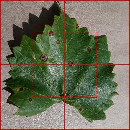
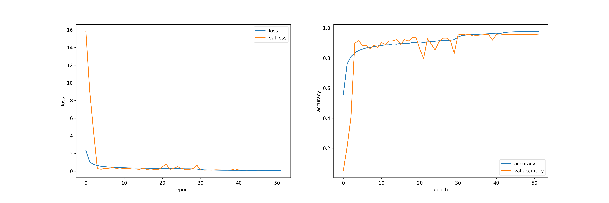

# Identify Diseases in Crops leaf

## Planter android application

### 👩🏻‍🌾 Download Planter application from [here](https://crop-foundation-home.herokuapp.com/download).

### for more details about planter 👉🏻 [Planter](https://crop-foundation-home.herokuapp.com/)

After extreme weather conditions and natural disasters, plant diseases and pests play a bigger role in the loss of our  
crop annually at least 20 - 40 % globally. Plant diseases oppose a greater threat on small and medium level farmlands  
because of a few reasons. One thing is lack of knowledge because farmers unable to identify situations in early-stage  
disease made great disasters. Other reasons are linked to the first reason. Which are if they need to identify diseases  
early stage they need experience as human experts. In both rural and developing countries struggling to find expert  
knowledge, even though if they are willing to find human experts, farmers cannot be able to spend a lot of money on hiring  
human experts.  So in rural areas or in developing countries are lack that expert knowledge and also farmers are unable  
to spend a lot of money on hiring human experts and costly tests to identify plant diseases.  Early detections are  
effective, but they need lots of resources and a bunch of human experts. So needs automatic, inexpensive and effective  
methods needs to address this problem.

Because of the recent advantages of deep learning methods, it is used almost always everywhere in every field. There is  
no change in computer vision. Deep learning especially convolutional neural networks are the go-to method for  
classification, detection and segmentation tasks. There are so many convolutional architectures that achieve the  
state-of-the-art situations in computer vision tasks. The most popular architectures are <b>AlexNet</b>[1], <b>VGGNet</b>[2],  
<b>GoogleNet</b>[3], <b>ResNet</b>[4] and they dominated classification and detection tasks.

There are already many studies done on disease identification and detections. But most of them are done on medium and  
high-quality images and also millions of images covering more situations. It is best to model but they need high  
computation power which poor farmers or researchers in poor countries can’t afford because of its cost. Because of that,  
we need a model that can train on low-quality images and more various situations on training for the more robust model.  
Network architecture after VGGNet[2] comes with deeper networks because deep networks are more accurate and increase the  
performance of the model. But it comes with a few drawbacks. The deeper the networks more the parameters to train and  
more parameters need long training and more computer power to train. And deeper networks are more likely to override on  
small datasets and lead to gradient vanishing resulting in stuck training. So more layers do not always improve model  
performance. 

One solution for this problem is to use skip connections. ResNet used this solution to effectively go deeper without  
dramatically increasing parameter count and training time. Also, they used heavy batch normalization. With all of these  
discoveries with our hands, we create a hybrid solution to train with low-quality low-resolution images that can work on  
a mobile platform. It is 34 weight layer deep and used concepts' comes from the residual net, google inception and also  
VGGNet to a more robust lightweight model. It trains with a dataset combined few well known and widely used leaf disease  
identification studies. Which are PlantVillage[5], Tea leaf disease dataset[6], Rice leaf disease dataset[7] and Banana  
leaf dataset[8].

## Methodology

### Data sources

 <b><i>sub sample of training data</i></b>

Data acquisitions are done in two ways. The main way of collecting labelled training samples is using already published  
leaf diseases data sets. For this work we used four different data sets which are the well-known plant village dataset[],  
rice leaf disease dataset[], banana leaf disease dataset[], and tea leaf dataset[]. There are 54000 images, 14 plants and  
42 subclasses in total in the plant village dataset. But we use a subset of it. Which include 11 plant types and 35  
subclasses. In the rice leaf disease, dataset 3355 images belong to four classes. In the banana dataset, there are 1289  
images in three subclasses and tea-leaf disease is quite small which only has 60 images belonging to three subclasses.  
All images are in RGB colour schema but have different dimensions, in the plant village dataset all images are in 256x256  
dimensions also the rice leaf dataset has the same dimensions. In tea, leaf images are in 133x200 and banana leaf images  
are in 150x113 dimension which is a much small dimension than other data we had.

| Plant       |         Subclass         |  Sample count |
|:------------|:------------------------:|--------------:|
| Apple       |           Scab           |           597 |
|             |         Back rot         |           559 |
|             |        Cedar rust        |           248 |
|             |         Healthy          |          1257 |
| Banana      |         Healthy          |           155 |
|             |         Segatoka         |           320 |
|             |       Xamthomonas        |           814 |
| Cherry      |         Healthy          |           769 |
|             |      Powder mildew       |           947 |
| Corn        |   Cercospora leaf spot   |           513 |
|             |       Common rust        |          1192 |
|             |         Healthy          |          1162 |
 |             |   Northern leaf blight   |           985 |
| Grape       |        Black rot         |          1062 |
|             |           Esca           |          1245 |
 |             |         Healthy          |           381 |
 |             |       Leaf blight        |           969 |
| Orange      |      Haunglongbing       |          4957 |
| Peach       |      Bacterial spot      |          2068 |
|             |         Healthy          |           324 |
| Papper      |      Bacterial spot      |           898 |
|             |         Healthy          |          1331 |
| Potato      |       Early blight       |           900 |
|             |         Healthy          |           137 |
|             |       Late blight        |           900 |
| Strawberry  |         Healthy          |           411 |
|             |       Leaf scorch        |           999 |
| Tea         |       Leaf blight        |            20 |
|             |      Red leaf spot       |            20 |
 |             |         Red scab         |            20 |
| Tomato      |      Bacterial spot      |          1915 |
|             |       Early blight       |           900 |
 |             |         Healthy          |          1432 |
 |             |       Late blight        |          1719 |
 |             |        Leaf mold         |           857 |
 |             |       Mosaic virus       |           336 |
 |             |    Septoria leaf spot    |          1594 |
 |             |       Spider mites       |          1509 |
 |             |       Target spot        |          1264 |
 |             |  Yellow leaf curl virus  |          4822 |

 <b><i>tree types, subclasses and sample sizes</i></b>

### Data pre-processing

Images need to have identical dimensions before being fed into the CNN so we resize those images to a single scale which  
is 224x224. Before that, most of the images are centred properly and had imbalance classes. We use methods to increase  
low sample size classes to some balance. One is using crop by using anchor points. Here we use five anchor points to  
create crops in initial sample points of more than 1000 and less than 3000 samples. Which are the top right corner, top  
left corner, bottom right corner, bottom left corner and centre of the frame. To do this cropping we resize the image  
into a 256x256 shape. Our target is to increase the sample size to 3000 to 4000 in those classes. For classes that have  
fewer samples than 1000, we used a different approach which is to use random crops alongside those bounding box cropping.  
Here we create a 2000 - 3000 sample size for those classes. After cropping then we resize all images to 224x224. Then we  
apply random rotation between -200 to 200. Also, colour space changes such as brightness, hue, and saturation are changed  
randomly.
  
  
#### cropped by corners and center of frame

#### more aggressive cropping approach to generate more images for very low sample size classes by using 3 scale sizes

#### changes make to color properties such as brightness, saturate, hue to make wide range of lighting scenarios

#### after all image pre-processing class and their sizes

## Experimental architecture for disease identification

several state-of-art CNN architectures were tried with augmented data such as VGG16, Inception and ResNet. and few hybrid  
architecture also tried which are created using above mention architectures. finally, hybrid model constructed by adopting  
inception and residual networks with heavy batch normalization. for preventing from over-fitting as above-mentioned data  
augmentation were used. other than that dropout layers were used in after each fully connected layer in classifier in each and  
every architecture. rectified linear unit activation function was used in hidden layer and 42 way softmax activation was  
used as final layer. because of limited computing power 224x224 size images was used to training.

 <b><i>full architecture of final hybrid network</i></b>

 <b><i>special deep-wide block</i></b>

first convolutional layer has 5x5 kernel size and 2x2 stride with same padding to preserve details. second convolution layer  
has 3x3 kernel size and 1x1 stride with same padding. batch normalizing is use between those layers without pooling layers.  
then stacked special block of layers is used among those sections' max pooling layers was used to down sampling. there are  
two skip path in this special deep-wide block with two depth concatenation. one skip path concatenate with main path and  
then output of that concatenate with another skip path adopted from residual net with 1x1 kernel size convolution layer and  
batch normalizing layer. those blocks used to create stack separate with other stack of deep-wide bocks by max-pooling layer.  
one hidden dense layer use in classifier with ReLU activation and 512 unites.

 <b><i>training history of deep-wide network</i></b>

training duration of each network with and without extra data to genaralize the model with complex background, human hands  
likewise.

| network                   | training duration |
|:--------------------------|------------------:|
| vgg                       |         5hr 25min |
| inception                 |         4hr 38min |
| hybrid-without-extra-data |         3hr 41min |
| hybrid-with-extra-data    |         4hr 43min |
